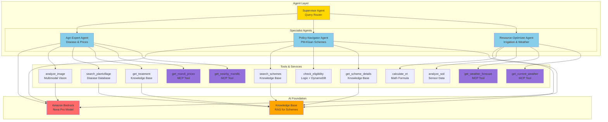
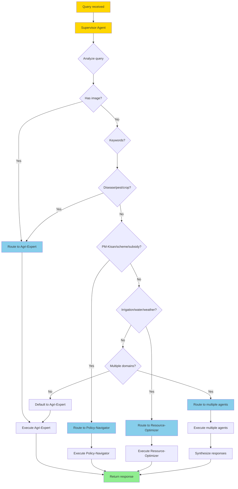
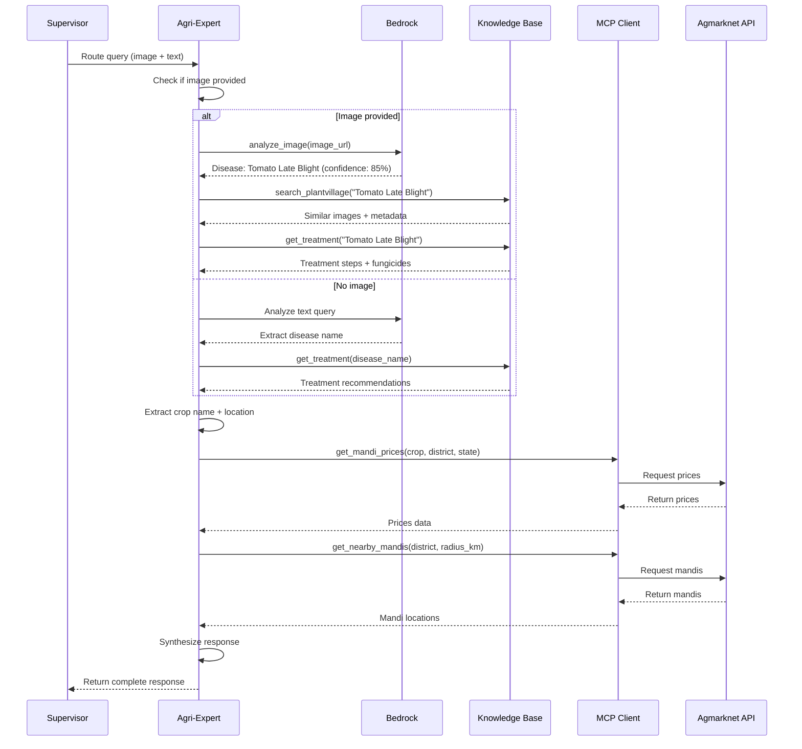
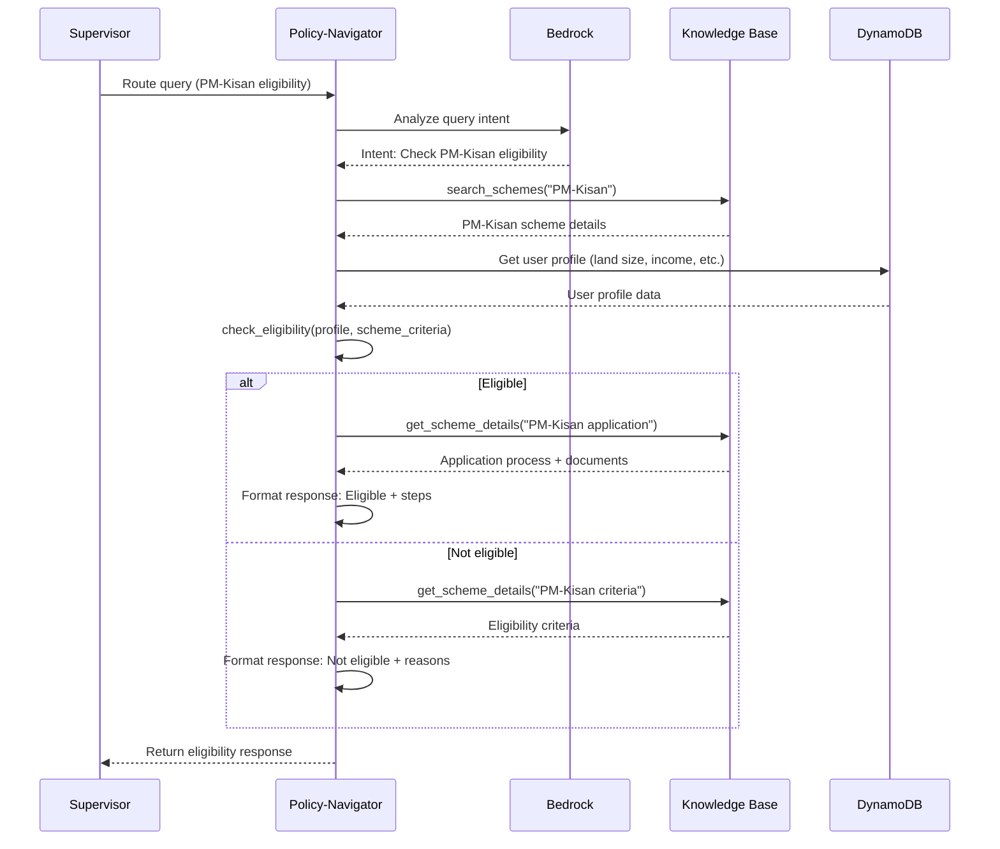
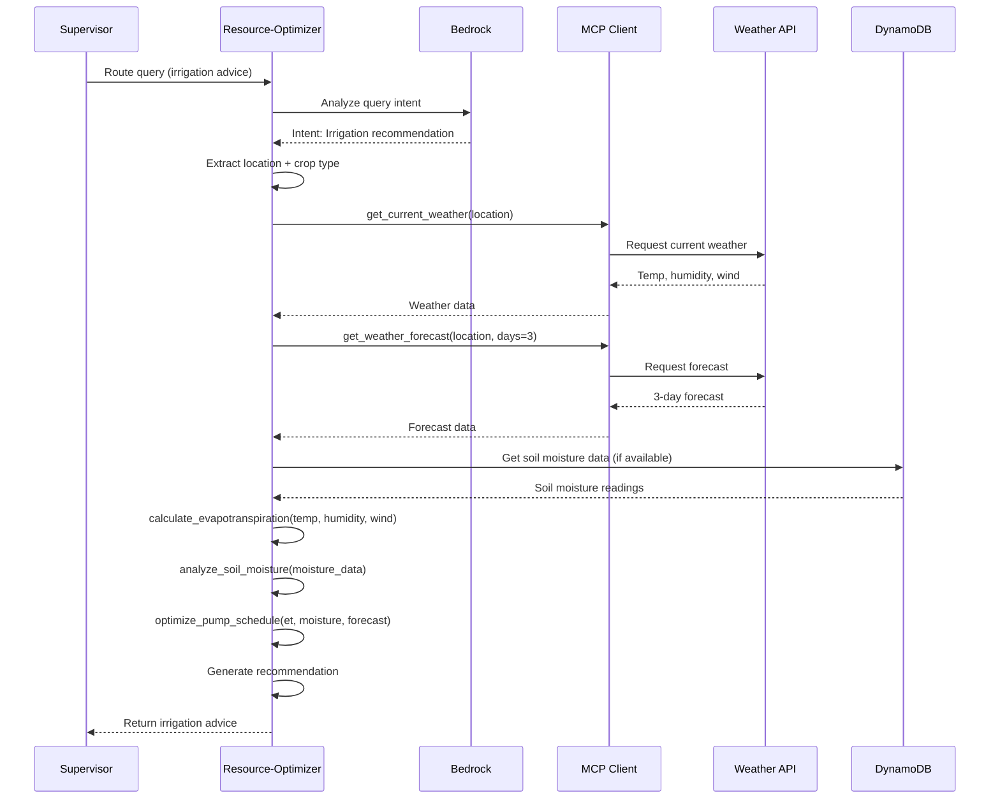
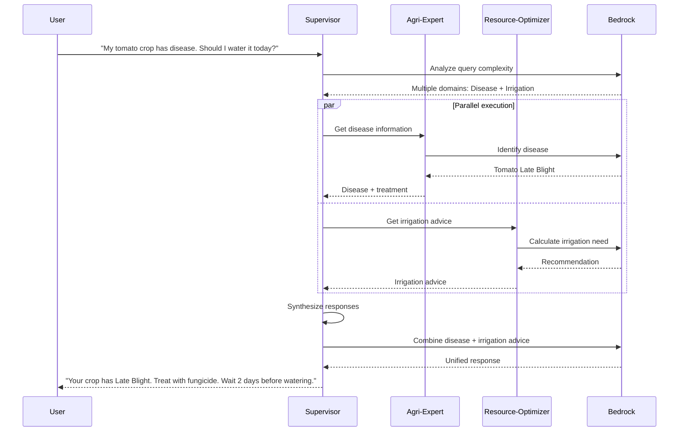
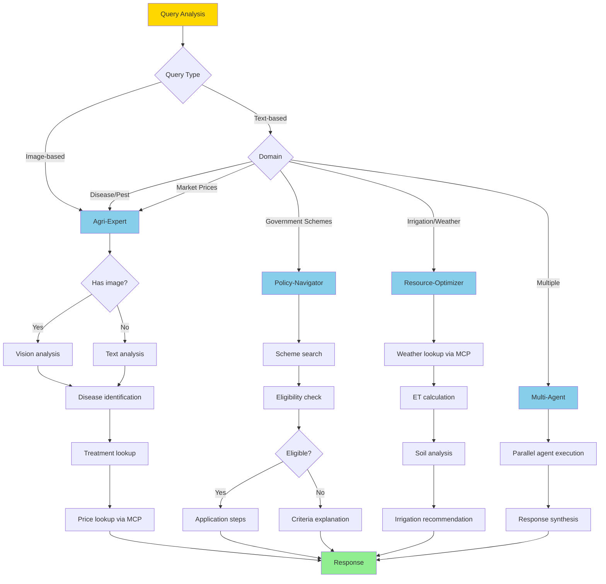
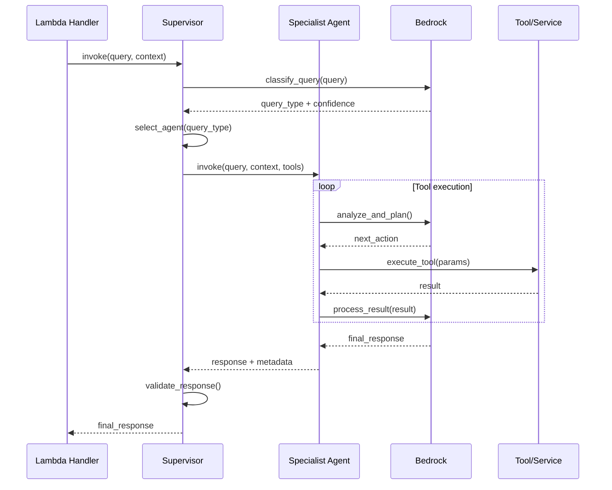
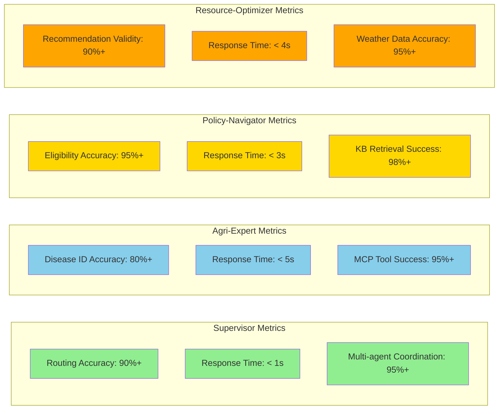

# URE Agent Interaction Diagram

## 1. Agent Architecture Overview

## 2. Supervisor Agent Routing Logic

## 3. Agri-Expert Agent Workflow

## 4. Policy-Navigator Agent Workflow

## 5. Resource-Optimizer Agent Workflow

## 6. Multi-Agent Coordination

## 7. Agent Tool Usage Matrix

| Agent | Tool | Type | Purpose |
|-------|------|------|---------|
| **Agri-Expert** | analyze_image | Bedrock | Identify crop disease from image |
| | search_plantvillage | Knowledge Base | Find similar disease images |
| | get_treatment | Knowledge Base | Retrieve treatment recommendations |
| | get_mandi_prices | MCP Tool | Fetch current market prices |
| | get_nearby_mandis | MCP Tool | Find nearby market locations |
| **Policy-Navigator** | search_schemes | Knowledge Base | Search government schemes |
| | check_eligibility | Logic + DynamoDB | Verify farmer eligibility |
| | get_scheme_details | Knowledge Base | Get scheme application details |
| **Resource-Optimizer** | calculate_et | Math Formula | Calculate evapotranspiration |
| | analyze_soil | Sensor Data | Interpret soil moisture levels |
| | get_weather_forecast | MCP Tool | Fetch weather forecast |
| | get_current_weather | MCP Tool | Get current weather conditions |

## 8. Agent Decision Tree

## 9. Agent Communication Protocol

## 10. Agent Performance Metrics

---

**Version**: 1.0.0  
**Last Updated**: February 28, 2026
