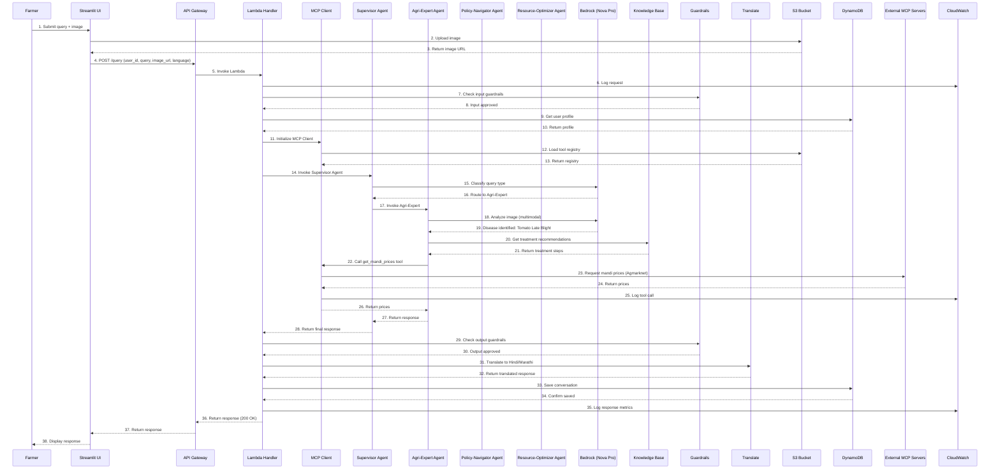
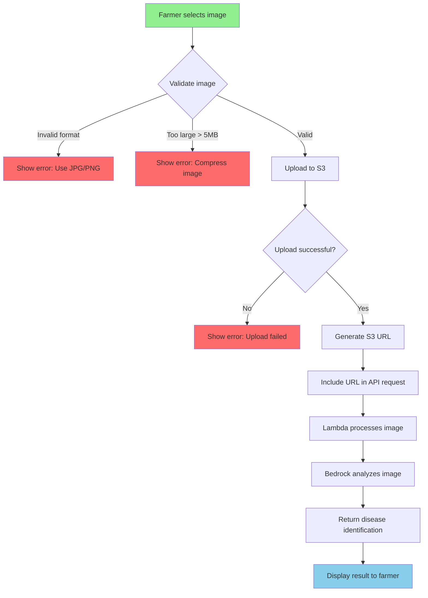
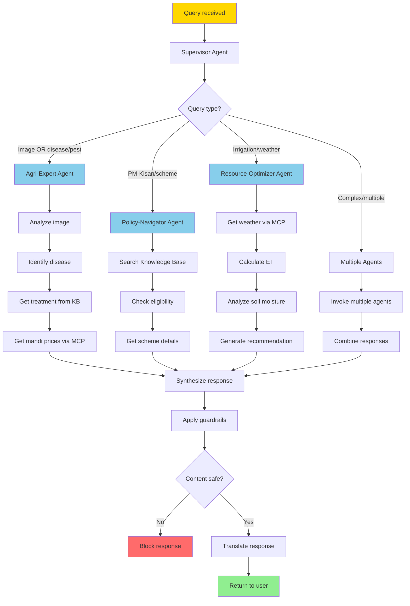
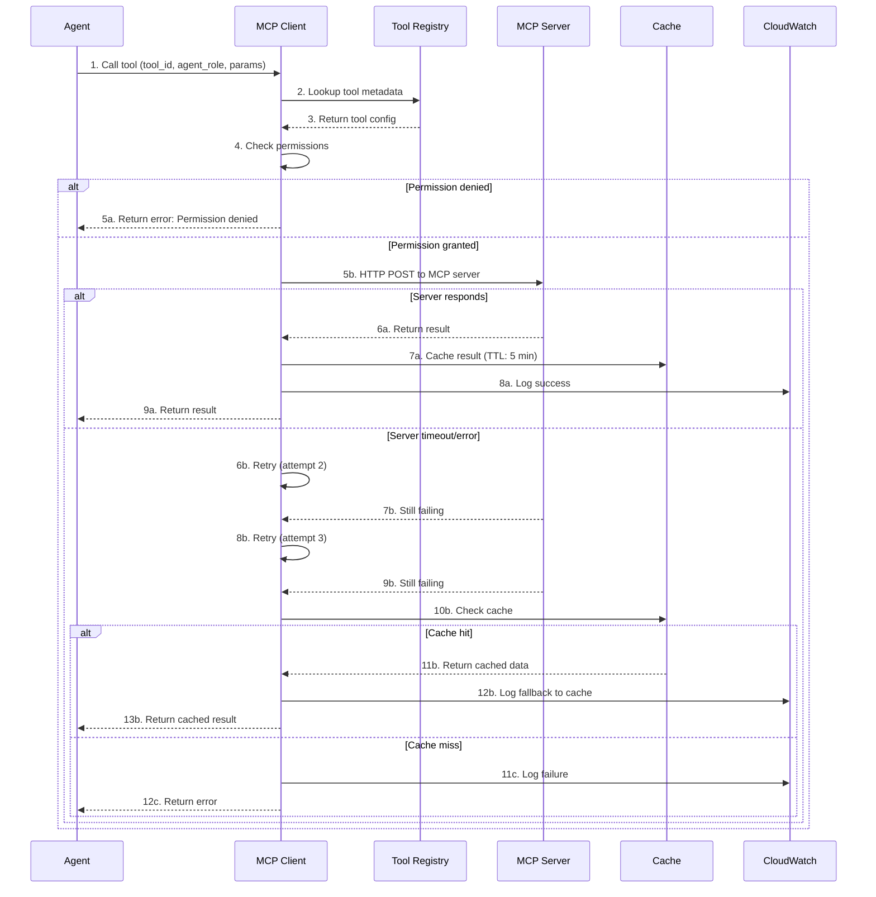
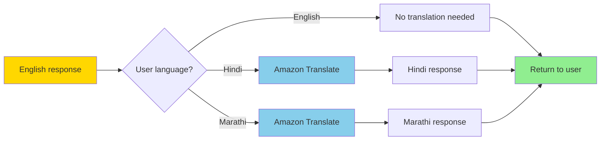
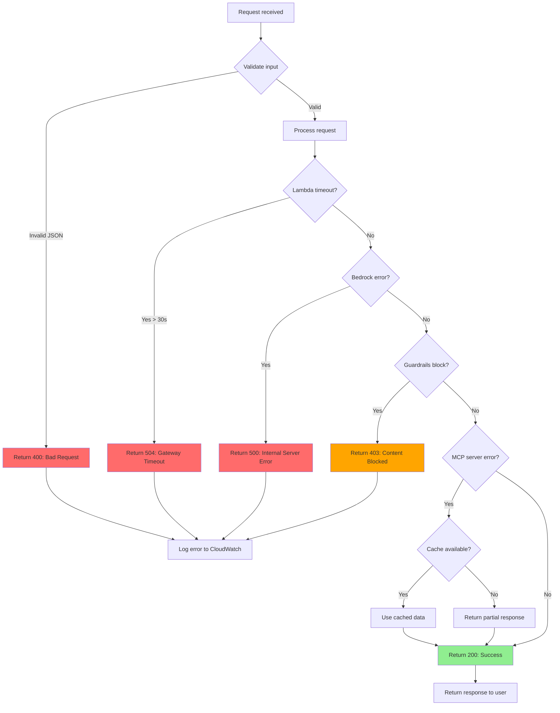
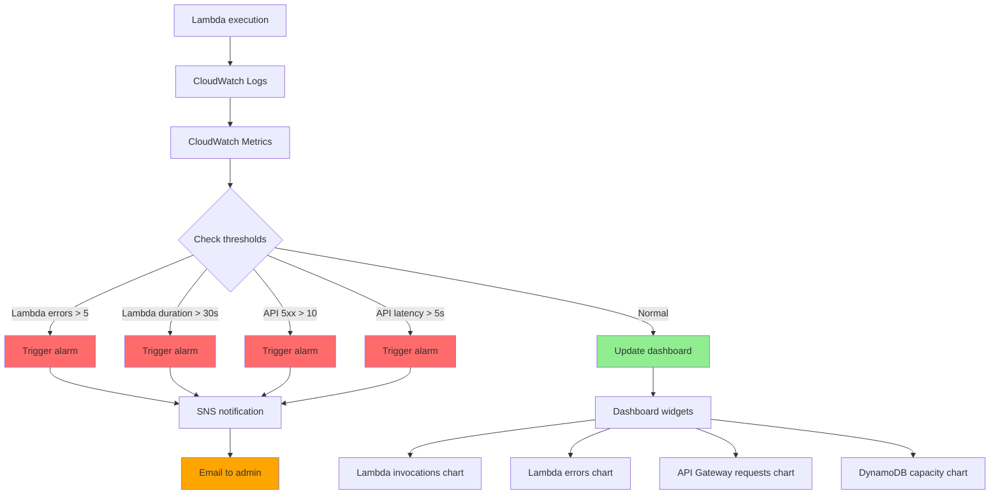
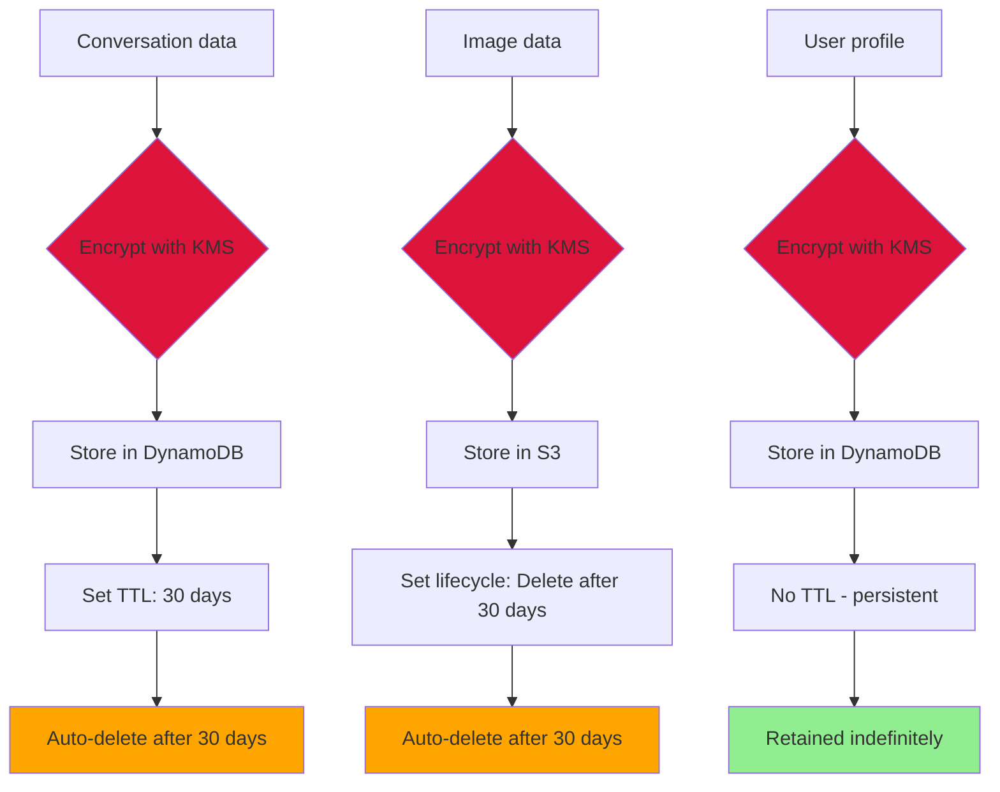

# URE Data Flow Diagram

## 1. Complete Request-Response Flow



## 2. Image Upload Flow



## 3. Agent Routing Flow



## 4. MCP Tool Call Flow



## 5. Guardrails Flow

```mermaid
flowchart TD
    A[Input/Output text] --> B[Bedrock Guardrails]
    B --> C{Check harmful content}
    C -->|Banned pesticides| D[Block: DDT, Endosulfan]
    C -->|Violence/hate| E[Block: Harmful advice]
    C -->|Off-topic| F[Block: Politics, religion]
    C -->|Safe| G{Check PII}
    
    D --> H[Return BLOCKED status]
    E --> H
    F --> H
    
    G -->|Email found| I[Anonymize: ***@***.com]
    G -->|Phone found| J[Anonymize: +91-XXXX-XXXX]
    G -->|Address found| K[Anonymize: [ADDRESS]]
    G -->|No PII| L[Return ALLOWED status]
    
    I --> L
    J --> L
    K --> L
    
    H --> M[Show error to user]
    L --> N[Continue processing]
    
    style D fill:#FF6B6B
    style E fill:#FF6B6B
    style F fill:#FF6B6B
    style H fill:#FF6B6B
    style M fill:#FF6B6B
    style N fill:#90EE90
```

## 6. Translation Flow



## 7. Error Handling Flow



## 8. Monitoring Flow



## 9. Data Persistence Flow



---

**Version**: 1.0.0  
**Last Updated**: February 28, 2026
