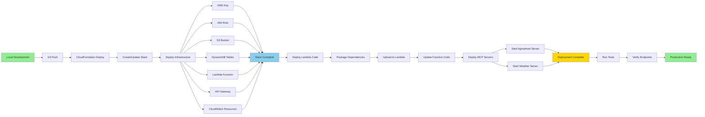
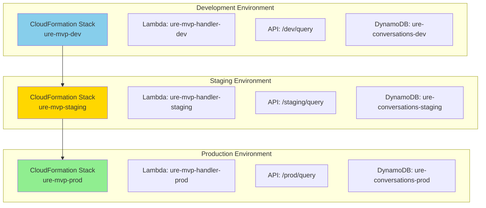
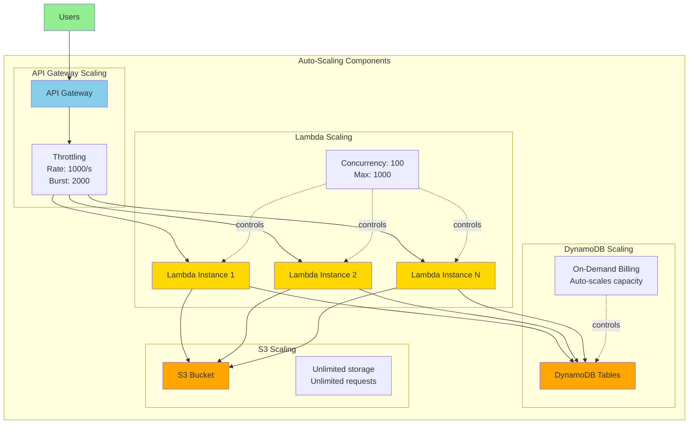
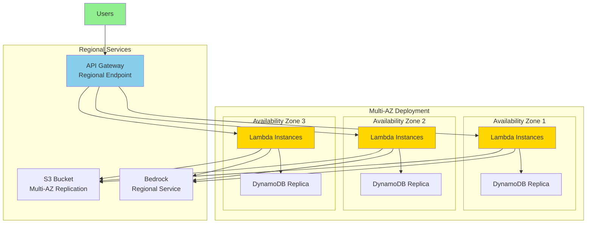
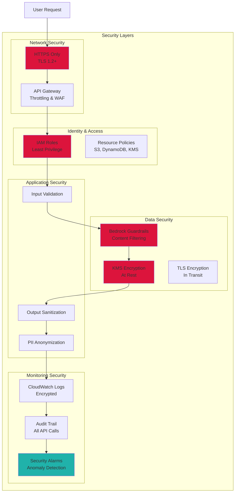
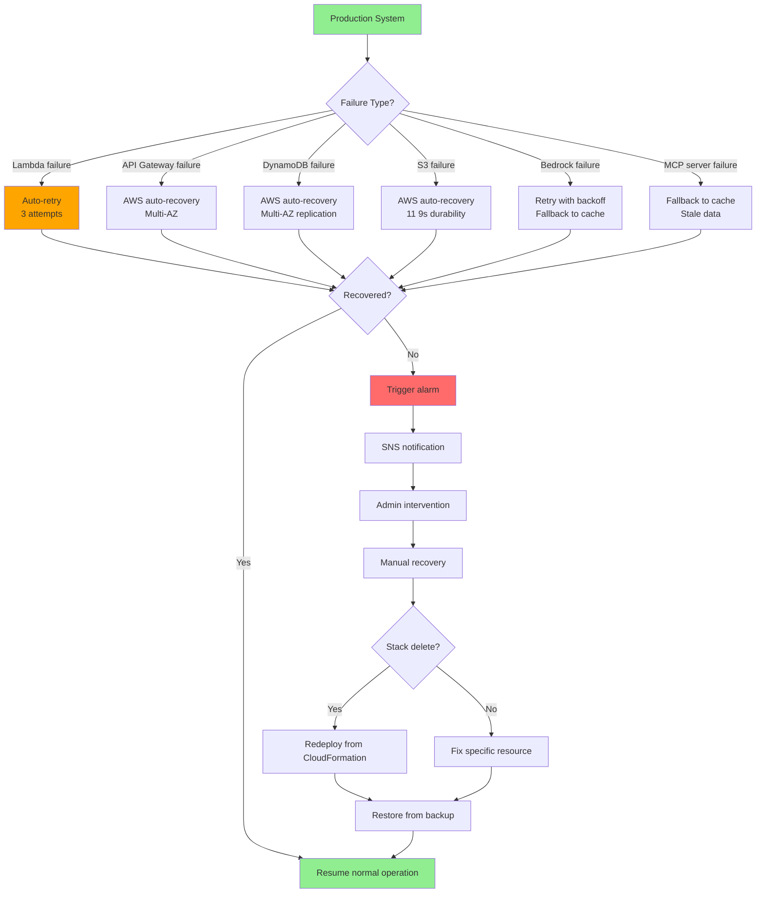
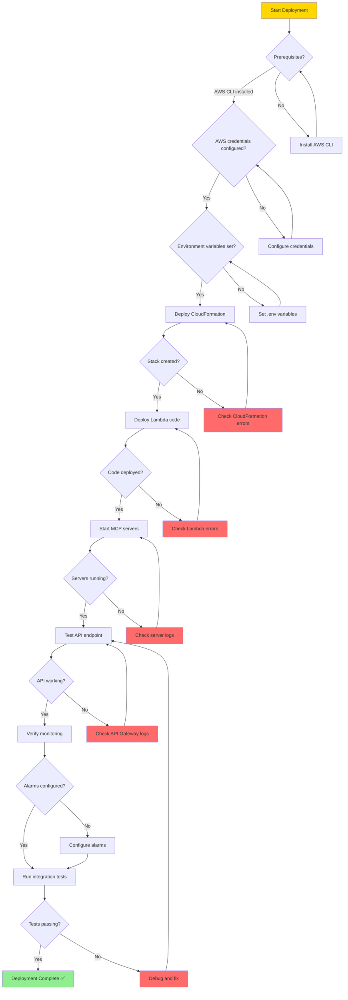

# URE Deployment Architecture

## 1. AWS Deployment Architecture

```mermaid
graph TB
    subgraph "Internet"
        USER[Farmers<br/>Web/Mobile Browsers]
    end
    
    subgraph "AWS Cloud - us-east-1"
        subgraph "Edge Layer"
            CF[CloudFront CDN<br/>(Future)]
            R53[Route 53<br/>DNS (Future)]
        end
        
        subgraph "Application Layer"
            APIGW[API Gateway<br/>REST API<br/>Throttling: 1000/s]
            
            subgraph "Compute"
                LAMBDA[Lambda Function<br/>ure-mvp-handler<br/>Memory: 512MB<br/>Timeout: 30s<br/>Concurrency: 100]
            end
        end
        
        subgraph "AI/ML Services"
            BEDROCK[Amazon Bedrock<br/>Nova Pro Model<br/>Inference Profile]
            KB[Bedrock Knowledge Base<br/>OpenSearch Serverless]
            GUARD[Bedrock Guardrails<br/>Content Filtering]
            TRANS[Amazon Translate<br/>Hindi/Marathi]
        end
        
        subgraph "Storage Services"
            S3[S3 Bucket<br/>ure-mvp-data<br/>Versioning: Enabled<br/>Encryption: KMS]
            
            DDB1[DynamoDB<br/>ure-conversations<br/>On-Demand<br/>TTL: 30 days]
            
            DDB2[DynamoDB<br/>ure-user-profiles<br/>On-Demand<br/>No TTL]
            
            DDB3[DynamoDB<br/>ure-village-amenities<br/>On-Demand<br/>No TTL]
        end
        
        subgraph "Security Services"
            KMS[KMS Key<br/>Encryption<br/>Auto-rotation]
            IAM[IAM Role<br/>ure-lambda-role<br/>Least Privilege]
            SECRETS[Secrets Manager<br/>API Keys (Future)]
        end
        
        subgraph "Monitoring Services"
            CW[CloudWatch<br/>Logs & Metrics]
            DASH[CloudWatch Dashboard<br/>ure-mvp-dashboard]
            ALARM[CloudWatch Alarms<br/>7 Alarms]
            SNS[SNS Topic<br/>ure-mvp-alarms]
        end
        
        subgraph "External Services"
            MCP1[MCP Server<br/>Agmarknet<br/>Port 8001]
            MCP2[MCP Server<br/>Weather<br/>Port 8002]
        end
    end
    
    subgraph "External APIs"
        AGAPI[Agmarknet API<br/>data.gov.in]
        WAPI[OpenWeather API<br/>openweathermap.org]
    end
    
    USER --> APIGW
    APIGW --> LAMBDA
    
    LAMBDA --> BEDROCK
    LAMBDA --> KB
    LAMBDA --> GUARD
    LAMBDA --> TRANS
    LAMBDA --> S3
    LAMBDA --> DDB1
    LAMBDA --> DDB2
    LAMBDA --> DDB3
    LAMBDA --> MCP1
    LAMBDA --> MCP2
    
    MCP1 --> AGAPI
    MCP2 --> WAPI
    
    KMS -.encrypts.-> S3
    KMS -.encrypts.-> DDB1
    KMS -.encrypts.-> DDB2
    KMS -.encrypts.-> DDB3
    KMS -.encrypts.-> CW
    
    IAM -.authorizes.-> LAMBDA
    
    LAMBDA --> CW
    CW --> DASH
    CW --> ALARM
    ALARM --> SNS
    
    style USER fill:#90EE90
    style APIGW fill:#87CEEB
    style LAMBDA fill:#FFD700
    style BEDROCK fill:#FF6B6B
    style S3 fill:#FFA500
    style DDB1 fill:#FFA500
    style KMS fill:#DC143C
    style CW fill:#20B2AA
```

## 2. CloudFormation Stack Resources

```mermaid
graph TB
    subgraph "CloudFormation Stack: ure-mvp-stack"
        subgraph "Security Resources"
            KMS[KMS Key<br/>URE-KMS-Key]
            IAM[IAM Role<br/>ure-mvp-lambda-role]
        end
        
        subgraph "Storage Resources"
            S3[S3 Bucket<br/>ure-mvp-data-{region}-{account}]
            DDB1[DynamoDB Table<br/>ure-conversations]
            DDB2[DynamoDB Table<br/>ure-user-profiles]
            DDB3[DynamoDB Table<br/>ure-village-amenities]
        end
        
        subgraph "Compute Resources"
            LAMBDA[Lambda Function<br/>ure-mvp-handler]
            APIGW[API Gateway<br/>ure-mvp-api]
            STAGE[API Stage<br/>dev/staging/prod]
        end
        
        subgraph "Monitoring Resources"
            LOG[Log Group<br/>/aws/lambda/ure-mvp-handler]
            DASH[Dashboard<br/>ure-mvp-dashboard]
            
            subgraph "Alarms"
                A1[Lambda Error Alarm]
                A2[Lambda Duration Alarm]
                A3[Lambda Throttle Alarm]
                A4[API 5xx Alarm]
                A5[API 4xx Alarm]
                A6[API Latency Alarm]
                A7[DynamoDB Throttle Alarm]
            end
            
            SNS[SNS Topic<br/>ure-mvp-alarms]
        end
    end
    
    KMS --> S3
    KMS --> DDB1
    KMS --> DDB2
    KMS --> DDB3
    KMS --> LOG
    
    IAM --> LAMBDA
    
    LAMBDA --> APIGW
    APIGW --> STAGE
    
    LAMBDA --> LOG
    LOG --> DASH
    
    A1 --> SNS
    A2 --> SNS
    A3 --> SNS
    A4 --> SNS
    A5 --> SNS
    A6 --> SNS
    A7 --> SNS
    
    style KMS fill:#DC143C
    style IAM fill:#DC143C
    style LAMBDA fill:#FFD700
    style S3 fill:#FFA500
    style DDB1 fill:#FFA500
    style DASH fill:#20B2AA
    style SNS fill:#20B2AA
```

## 3. Deployment Pipeline



## 4. Multi-Environment Strategy



## 5. Scaling Architecture



## 6. High Availability Architecture



## 7. Security Architecture



## 8. Disaster Recovery Architecture



## 9. Cost Optimization Architecture

```mermaid
graph TB
    subgraph "Cost Controls"
        subgraph "Lambda Optimization"
            L1[Reserved Concurrency: 100<br/>Prevents runaway costs]
            L2[Memory: 512MB<br/>Balanced performance/cost]
            L3[Timeout: 30s<br/>Prevents long-running costs]
        end
        
        subgraph "API Gateway Optimization"
            A1[Throttling: 1000/s<br/>Prevents abuse]
            A2[Caching: Disabled<br/>Save on cache costs]
        end
        
        subgraph "DynamoDB Optimization"
            D1[On-Demand Billing<br/>Pay per request]
            D2[TTL: 30 days<br/>Auto-delete old data]
        end
        
        subgraph "S3 Optimization"
            S1[Lifecycle Policy<br/>Delete after 30 days]
            S2[Intelligent Tiering<br/>Auto-move to cheaper storage]
        end
        
        subgraph "Bedrock Optimization"
            B1[Inference Profile<br/>Cross-region routing]
            B2[Prompt Caching<br/>Reduce token costs]
        end
        
        subgraph "MCP Optimization"
            M1[TTL Cache: 5 min<br/>Reduce API calls]
            M2[Batch Requests<br/>Combine multiple calls]
        end
    end
    
    COST[Total Cost: ~$73/month] --> L1
    COST --> A1
    COST --> D1
    COST --> S1
    COST --> B1
    COST --> M1
    
    style COST fill:#90EE90
    style L1 fill:#87CEEB
    style A1 fill:#87CEEB
    style D1 fill:#FFA500
    style S1 fill:#FFA500
    style B1 fill:#FF6B6B
    style M1 fill:#9370DB
```



## 10. Deployment Checklist



---

**Version**: 1.0.0  
**Last Updated**: February 28, 2026
