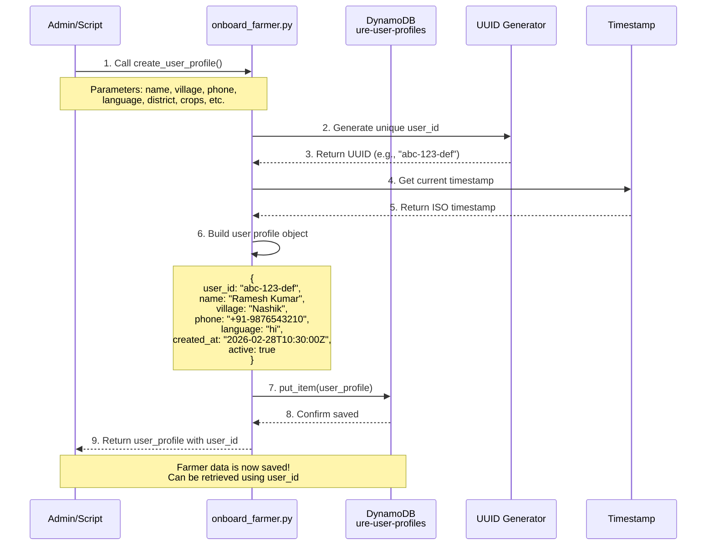
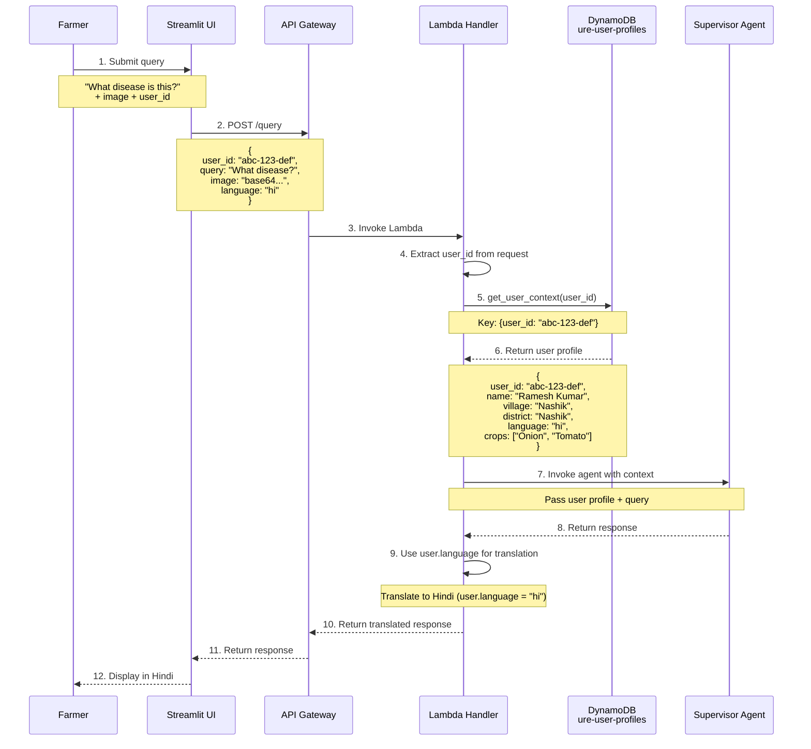
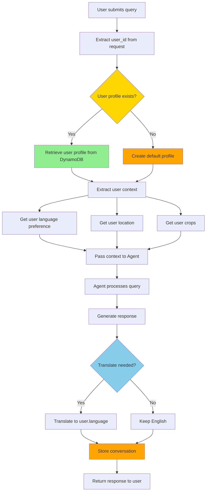

# Farmer Data Flow - Save & Retrieve

## Overview

This document explains how farmer data is saved and retrieved in the URE system.

---

## 1. Farmer Data Storage Architecture

```mermaid
graph TB
    subgraph "Data Storage"
        DDB1[DynamoDB Table<br/>ure-user-profiles<br/>Primary Key: user_id]
        DDB2[DynamoDB Table<br/>ure-conversations<br/>Primary Key: user_id]
        DDB3[DynamoDB Table<br/>ure-feedback<br/>Primary Key: feedback_id]
    end
    
    subgraph "Farmer Profile Data"
        P1[user_id: UUID]
        P2[name: String]
        P3[village: String]
        P4[district: String]
        P5[phone: String]
        P6[language: en/hi/mr]
        P7[land_size_acres: Number]
        P8[crops: List]
        P9[created_at: Timestamp]
        P10[active: Boolean]
    end
    
    subgraph "Conversation Data"
        C1[user_id: UUID]
        C2[conversations: List]
        C3[timestamp: Timestamp]
        C4[query: String]
        C5[response: String]
        C6[agent_used: String]
        C7[last_updated: Timestamp]
    end
    
    P1 --> DDB1
    P2 --> DDB1
    P3 --> DDB1
    P4 --> DDB1
    P5 --> DDB1
    P6 --> DDB1
    P7 --> DDB1
    P8 --> DDB1
    P9 --> DDB1
    P10 --> DDB1
    
    C1 --> DDB2
    C2 --> DDB2
    C3 --> DDB2
    C4 --> DDB2
    C5 --> DDB2
    C6 --> DDB2
    C7 --> DDB2
    
    style DDB1 fill:#FFA500
    style DDB2 fill:#FFA500
    style DDB3 fill:#FFA500
```



---

## 2. Farmer Onboarding Flow (Save)



---

## 3. Farmer Data Retrieval Flow (Query Processing)



---

## 4. Data Structure Details

### User Profile Table (ure-user-profiles)

```json
{
  "user_id": "abc-123-def-456",           // Primary Key (UUID)
  "name": "Ramesh Kumar",                 // Farmer name
  "village": "Nashik",                    // Village name
  "district": "Nashik",                   // District
  "state": "Maharashtra",                 // State
  "phone": "+91-9876543210",              // Phone number
  "language": "hi",                       // Preferred language (en/hi/mr)
  "land_size_acres": 5.0,                 // Land size (optional)
  "crops": ["Onion", "Tomato"],           // Crops grown (optional)
  "email": "ramesh@example.com",          // Email (optional)
  "created_at": "2026-02-28T10:30:00Z",   // Creation timestamp
  "updated_at": "2026-02-28T10:30:00Z",   // Last update timestamp
  "onboarding_status": "completed",       // Onboarding status
  "onboarding_date": "2026-02-28T10:30:00Z", // Onboarding date
  "active": true                          // Active status
}
```

### Conversation Table (ure-conversations)

```json
{
  "user_id": "abc-123-def-456",           // Primary Key (same as user profile)
  "conversations": [                      // List of conversations
    {
      "timestamp": "2026-02-28T11:00:00Z",
      "query": "What disease is this?",
      "response": "This is tomato late blight...",
      "agent_used": "agri-expert",
      "metadata": {
        "image_analysis": "...",
        "translated": true,
        "target_language": "hi"
      }
    },
    {
      "timestamp": "2026-02-28T11:15:00Z",
      "query": "What is onion price?",
      "response": "Current onion price in Nashik is ₹30/kg",
      "agent_used": "agri-expert",
      "metadata": {
        "mandi_prices": {...}
      }
    }
  ],
  "last_updated": "2026-02-28T11:15:00Z"  // Last conversation timestamp
}
```

---

## 5. Save Operations

### 5.1 Single Farmer Onboarding

```python
# Using onboard_farmer.py script
from scripts.onboard_farmer import FarmerOnboarding

onboarding = FarmerOnboarding()

# Create user profile
user_profile = onboarding.create_user_profile(
    name="Ramesh Kumar",
    village="Nashik",
    phone="+91-9876543210",
    language="hi",
    district="Nashik",
    state="Maharashtra",
    land_size_acres=5.0,
    crops=["Onion", "Tomato"],
    email="ramesh@example.com"
)

# Returns:
# {
#   'user_id': 'abc-123-def-456',
#   'name': 'Ramesh Kumar',
#   'village': 'Nashik',
#   ...
# }
```

### 5.2 Batch Onboarding from CSV

```python
# Using onboard_farmer.py script
results = onboarding.batch_onboard_from_csv('farmers.csv')

# Returns:
# {
#   'success': 45,
#   'failed': 5,
#   'errors': [...]
# }
```

### 5.3 DynamoDB Put Operation

```python
# Internal implementation
import boto3
from datetime import datetime
import uuid

dynamodb = boto3.resource('dynamodb')
table = dynamodb.Table('ure-user-profiles')

user_profile = {
    'user_id': str(uuid.uuid4()),
    'name': 'Ramesh Kumar',
    'village': 'Nashik',
    'phone': '+91-9876543210',
    'language': 'hi',
    'created_at': datetime.utcnow().isoformat(),
    'active': True
}

# Save to DynamoDB
table.put_item(Item=user_profile)
```

---

## 6. Retrieve Operations

### 6.1 Get User Profile by ID

```python
# In Lambda handler
def get_user_context(user_id: str) -> Optional[Dict]:
    """Retrieve user context from DynamoDB"""
    try:
        table = dynamodb.Table('ure-user-profiles')
        response = table.get_item(Key={'user_id': user_id})
        return response.get('Item')
    except Exception as e:
        logger.error(f"Failed to get user context: {e}")
        return None

# Usage
user_context = get_user_context('abc-123-def-456')
# Returns:
# {
#   'user_id': 'abc-123-def-456',
#   'name': 'Ramesh Kumar',
#   'village': 'Nashik',
#   'language': 'hi',
#   ...
# }
```

### 6.2 List All Users

```python
# Using onboard_farmer.py script
users = onboarding.list_all_users()

# Returns list of all user profiles
# [
#   {'user_id': '...', 'name': 'Ramesh Kumar', ...},
#   {'user_id': '...', 'name': 'Sunita Patil', ...},
#   ...
# ]
```

### 6.3 Get Conversation History

```python
# In Lambda handler
def get_conversation_history(user_id: str, limit: int = 5) -> list:
    """Retrieve recent conversation history"""
    try:
        table = dynamodb.Table('ure-conversations')
        response = table.get_item(Key={'user_id': user_id})
        
        if 'Item' in response:
            conversations = response['Item'].get('conversations', [])
            return conversations[-limit:]  # Last N conversations
        return []
    except Exception as e:
        logger.error(f"Failed to get conversation history: {e}")
        return []
```

---

## 7. Update Operations

### 7.1 Update User Profile

```python
# Using onboard_farmer.py script
updates = {
    'land_size_acres': 7.0,
    'crops': ['Onion', 'Tomato', 'Potato']
}

success = onboarding.update_user_profile(user_id, updates)
```

### 7.2 Store Conversation

```python
# In Lambda handler
def store_conversation(
    user_id: str,
    query: str,
    response: str,
    agent_used: str,
    metadata: Optional[Dict] = None
):
    """Store conversation in DynamoDB"""
    table = dynamodb.Table('ure-conversations')
    
    # Get existing conversations
    existing = table.get_item(Key={'user_id': user_id})
    conversations = existing.get('Item', {}).get('conversations', [])
    
    # Add new conversation
    conversations.append({
        'timestamp': datetime.utcnow().isoformat(),
        'query': query,
        'response': response,
        'agent_used': agent_used,
        'metadata': metadata or {}
    })
    
    # Keep only last 50 conversations
    if len(conversations) > 50:
        conversations = conversations[-50:]
    
    # Update table
    table.put_item(Item={
        'user_id': user_id,
        'conversations': conversations,
        'last_updated': datetime.utcnow().isoformat()
    })
```

---

## 8. Delete Operations

### 8.1 Soft Delete (Deactivate)

```python
# Using onboard_farmer.py script
success = onboarding.delete_user_profile(user_id)

# Sets active = False (soft delete)
# User data is retained but marked as inactive
```

### 8.2 Hard Delete (Not Recommended)

```python
# Direct DynamoDB delete (use with caution)
table = dynamodb.Table('ure-user-profiles')
table.delete_item(Key={'user_id': user_id})

# Permanently removes user data
# Cannot be recovered
```

---

## 9. Data Flow in Query Processing



---

## 10. Key Points

### Data Persistence
- **User profiles**: Stored permanently in `ure-user-profiles` table
- **Conversations**: Stored in `ure-conversations` table with 30-day TTL
- **Feedback**: Stored in `ure-feedback` table (auto-created on first use)

### Data Encryption
- All data encrypted at rest using KMS
- All data encrypted in transit using HTTPS/TLS

### Data Access
- **Primary Key**: `user_id` (UUID) for fast lookups
- **No scanning**: Always use `get_item()` with user_id for efficiency
- **Pagination**: Handled automatically for large result sets

### Data Retention
- **User profiles**: Retained indefinitely (no TTL)
- **Conversations**: Auto-deleted after 30 days (TTL)
- **Images**: Auto-deleted after 30 days (S3 lifecycle policy)

### Performance
- **Read latency**: < 10ms (DynamoDB single-digit millisecond latency)
- **Write latency**: < 10ms
- **Consistency**: Eventually consistent reads (can use strongly consistent if needed)

---

## 11. CLI Commands Reference

### Onboard Farmer
```bash
# Single farmer
python scripts/onboard_farmer.py \
  --name "Ramesh Kumar" \
  --village "Nashik" \
  --phone "+91-9876543210" \
  --language "hi"

# Batch from CSV
python scripts/onboard_farmer.py --batch farmers.csv
```

### List Farmers
```bash
python scripts/onboard_farmer.py --list
```

### Get Farmer Profile
```bash
python scripts/onboard_farmer.py --get <user_id>
```

### Generate Report
```bash
python scripts/onboard_farmer.py --report
```

---

**Version**: 1.0.0  
**Last Updated**: February 28, 2026
