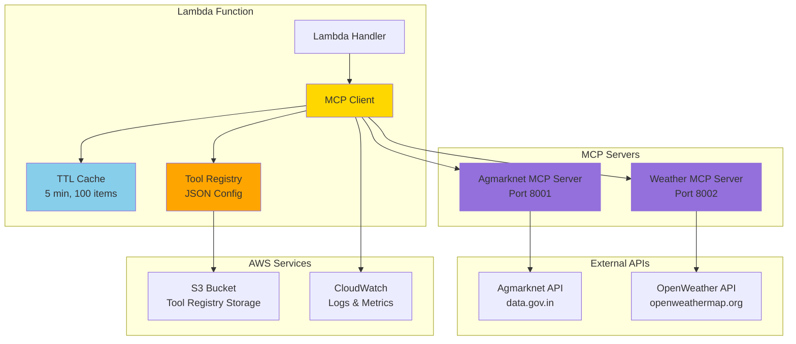
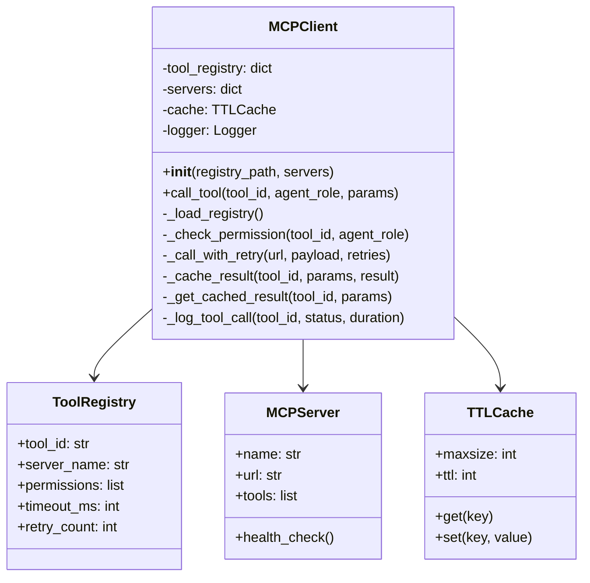
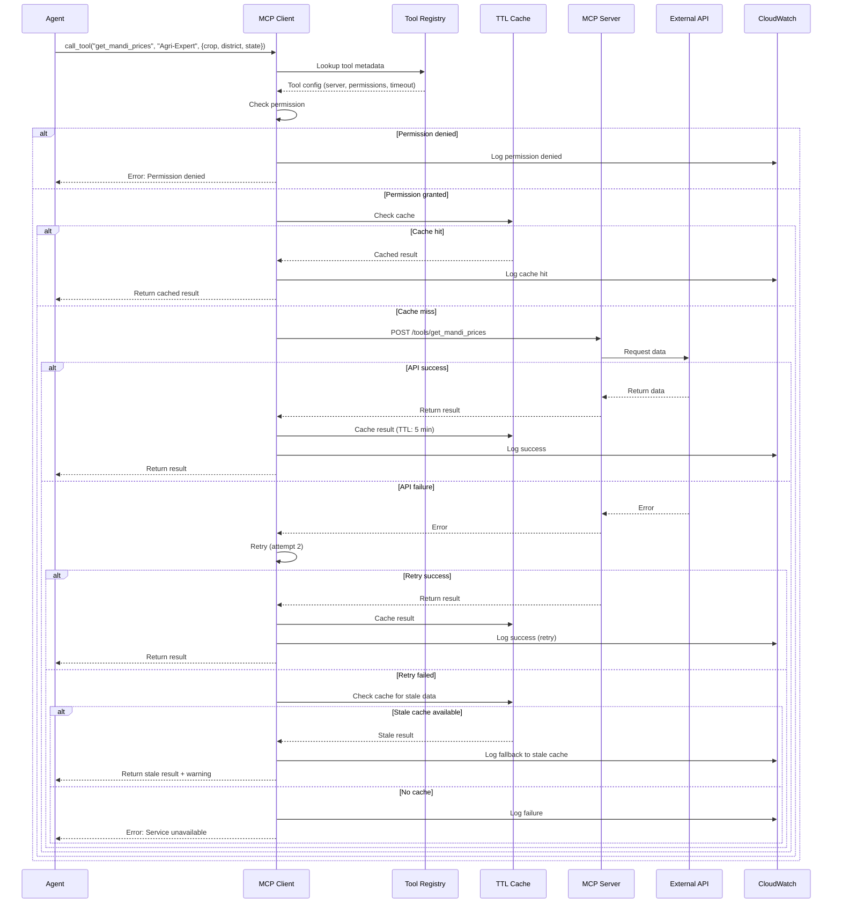
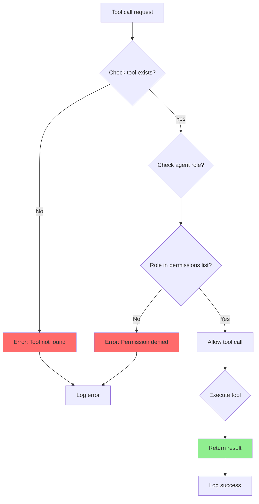
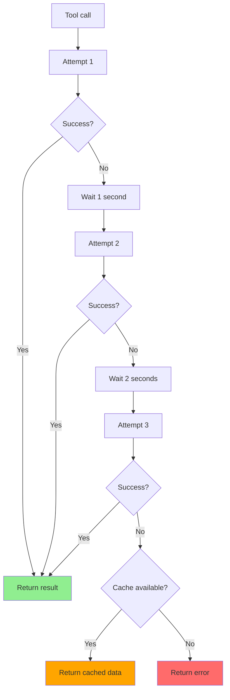
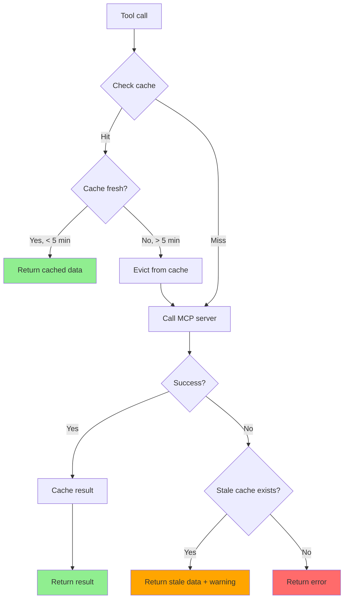
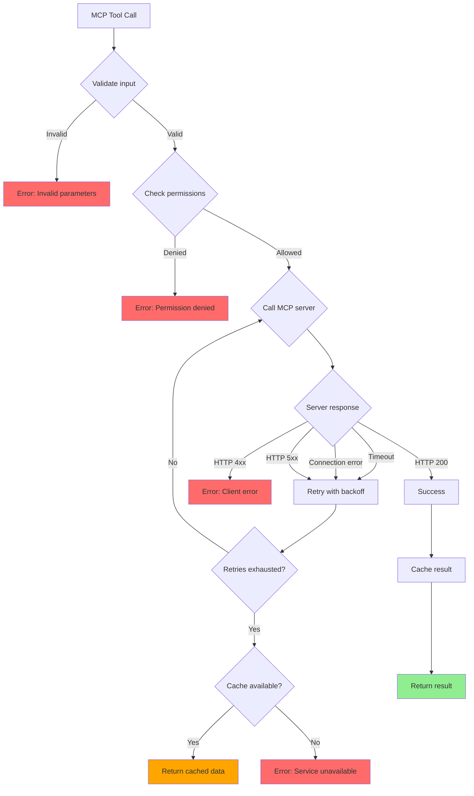
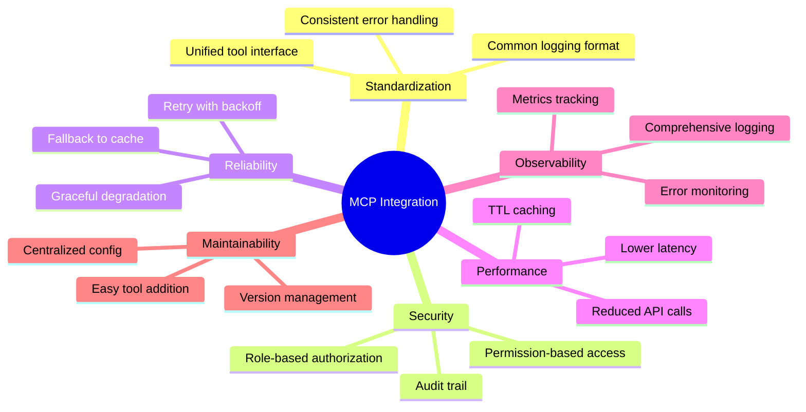
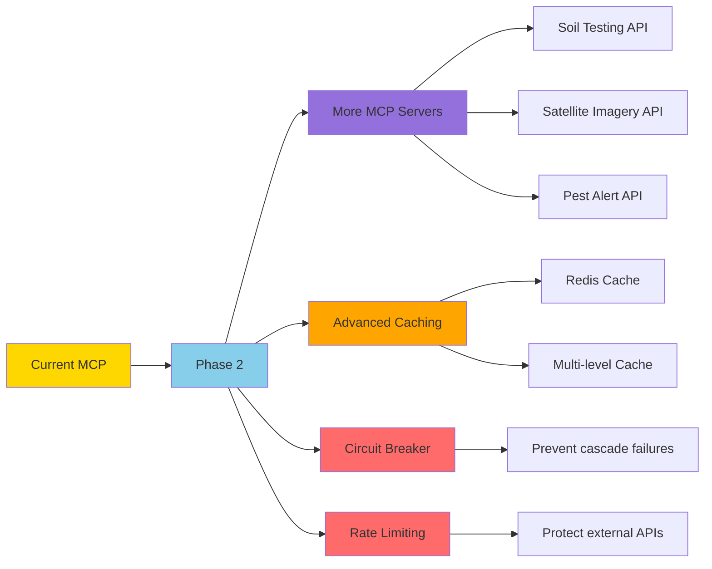

# URE MCP Integration Architecture

## 1. MCP Integration Overview



## 2. MCP Client Architecture



## 3. Tool Registry Structure

```json
{
  "get_mandi_prices": {
    "tool_id": "get_mandi_prices",
    "server_name": "agmarknet",
    "description": "Get current market prices for crops",
    "permissions": ["Agri-Expert", "Supervisor"],
    "timeout_ms": 5000,
    "retry_count": 3,
    "parameters": {
      "crop": "string (required)",
      "district": "string (required)",
      "state": "string (required)"
    }
  },
  "get_nearby_mandis": {
    "tool_id": "get_nearby_mandis",
    "server_name": "agmarknet",
    "description": "Find nearby market locations",
    "permissions": ["Agri-Expert", "Supervisor"],
    "timeout_ms": 5000,
    "retry_count": 3,
    "parameters": {
      "district": "string (required)",
      "radius_km": "number (optional, default: 50)"
    }
  },
  "get_current_weather": {
    "tool_id": "get_current_weather",
    "server_name": "weather",
    "description": "Get current weather conditions",
    "permissions": ["Resource-Optimizer", "Supervisor"],
    "timeout_ms": 5000,
    "retry_count": 3,
    "parameters": {
      "location": "string (required)",
      "units": "string (optional, default: metric)"
    }
  },
  "get_weather_forecast": {
    "tool_id": "get_weather_forecast",
    "server_name": "weather",
    "description": "Get weather forecast for next N days",
    "permissions": ["Resource-Optimizer", "Supervisor"],
    "timeout_ms": 5000,
    "retry_count": 3,
    "parameters": {
      "location": "string (required)",
      "days": "number (optional, default: 3)"
    }
  }
}
```

## 4. MCP Tool Call Flow



## 5. Permission System



### Permission Matrix

| Tool | Agri-Expert | Policy-Navigator | Resource-Optimizer | Supervisor |
|------|-------------|------------------|-------------------|------------|
| get_mandi_prices | ✅ | ❌ | ❌ | ✅ |
| get_nearby_mandis | ✅ | ❌ | ❌ | ✅ |
| get_current_weather | ❌ | ❌ | ✅ | ✅ |
| get_weather_forecast | ❌ | ❌ | ✅ | ✅ |

## 6. Retry Logic with Exponential Backoff



### Retry Configuration

```python
# Retry settings
MAX_RETRIES = 3
BACKOFF_FACTOR = 1  # seconds
TIMEOUT = 5  # seconds per request

# Retry delays
# Attempt 1: 0 seconds (immediate)
# Attempt 2: 1 second wait
# Attempt 3: 2 seconds wait
# Total max time: 5s + 1s + 5s + 2s + 5s = 18 seconds
```

## 7. Caching Strategy



### Cache Configuration

```python
# Cache settings
CACHE_TTL = 300  # 5 minutes
CACHE_MAXSIZE = 100  # Max 100 items
CACHE_KEY_FORMAT = "{tool_id}:{params_hash}"

# Cache eviction policy: LRU (Least Recently Used)
# Stale data retention: 30 minutes (for fallback)
```

## 8. MCP Server Implementation

### Agmarknet MCP Server

```mermaid
graph LR
    A[MCP Server] --> B[FastAPI App]
    B --> C[/tools/get_mandi_prices]
    B --> D[/tools/get_nearby_mandis]
    B --> E[/health]
    
    C --> F[Agmarknet API]
    D --> F
    
    F --> G[data.gov.in]
    
    style A fill:#9370DB
    style B fill:#87CEEB
    style F fill:#FFA500
```

### Weather MCP Server

```mermaid
graph LR
    A[MCP Server] --> B[FastAPI App]
    B --> C[/tools/get_current_weather]
    B --> D[/tools/get_weather_forecast]
    B --> E[/health]
    
    C --> F[OpenWeather API]
    D --> F
    
    F --> G[openweathermap.org]
    
    style A fill:#9370DB
    style B fill:#87CEEB
    style F fill:#FFA500
```

## 9. Error Handling



## 10. Monitoring & Logging

```mermaid
flowchart TD
    A[MCP Tool Call] --> B[Log: Tool invocation]
    B --> C[Execute tool]
    C --> D{Result}
    
    D -->|Success| E[Log: Success]
    D -->|Cache hit| F[Log: Cache hit]
    D -->|Retry| G[Log: Retry attempt]
    D -->|Fallback| H[Log: Fallback to cache]
    D -->|Error| I[Log: Error]
    
    E --> J[CloudWatch Metrics]
    F --> J
    G --> J
    H --> J
    I --> J
    
    J --> K[Dashboard Widget]
    J --> L[Alarm Threshold]
    
    L --> M{Threshold exceeded?}
    M -->|Yes| N[Trigger alarm]
    M -->|No| O[Continue monitoring]
    
    style E fill:#90EE90
    style F fill:#87CEEB
    style G fill:#FFA500
    style H fill:#FFA500
    style I fill:#FF6B6B
```



### Logged Metrics

```python
# CloudWatch metrics
metrics = {
    "mcp_tool_calls_total": "Counter",
    "mcp_tool_calls_success": "Counter",
    "mcp_tool_calls_failure": "Counter",
    "mcp_tool_calls_cache_hit": "Counter",
    "mcp_tool_calls_retry": "Counter",
    "mcp_tool_calls_fallback": "Counter",
    "mcp_tool_call_duration_ms": "Histogram",
    "mcp_cache_size": "Gauge",
    "mcp_permission_denied": "Counter"
}
```

## 11. MCP Integration Benefits



## 12. Future Enhancements



---

**Version**: 1.0.0  
**Last Updated**: February 28, 2026
