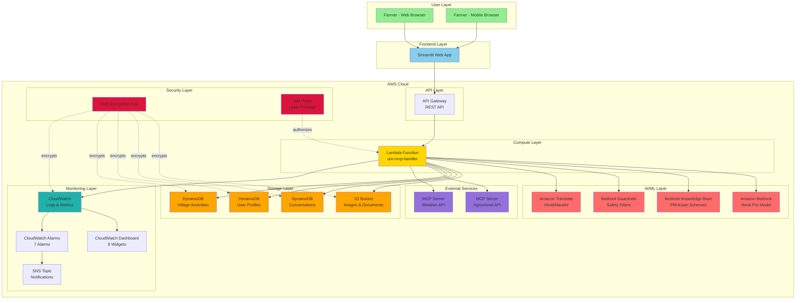

# URE System Architecture

## 1. System Architecture Diagram

## 2. Component Descriptions

### User Layer
- **Farmers**: Access via web or mobile browsers
- **Interface**: Responsive Streamlit web application

### Frontend Layer
- **Streamlit App**: Python-based web interface
- **Features**: Query input, image upload, language selection, conversation history

### API Layer
- **API Gateway**: REST API endpoint for Lambda invocation
- **Throttling**: 1000 req/s rate limit, 2000 burst limit
- **Authentication**: API key-based (future enhancement)

### Compute Layer
- **Lambda Function**: Serverless compute for request processing
- **Concurrency**: Reserved concurrency of 100
- **Timeout**: 30 seconds
- **Memory**: 512 MB

### AI/ML Layer
- **Amazon Bedrock**: Nova Pro model for agent orchestration
- **Knowledge Base**: RAG for PM-Kisan scheme information
- **Guardrails**: Safety filters for harmful content
- **Translate**: Multi-language support (English, Hindi, Marathi)

### Storage Layer
- **S3 Bucket**: Stores images, documents, MCP tool registry
- **DynamoDB Tables**:
  - Conversations: Query history and responses
  - User Profiles: Farmer information
  - Village Amenities: Location-based data

### External Services
- **MCP Servers**: Model Context Protocol servers for external data
  - Agmarknet: Market prices and mandi locations
  - Weather: Current weather and forecasts

### Monitoring Layer
- **CloudWatch Logs**: Application and error logs
- **CloudWatch Dashboard**: 8 widgets for metrics visualization
- **CloudWatch Alarms**: 7 alarms for error detection
- **SNS Topic**: Email notifications for alarms

### Security Layer
- **KMS**: Encryption key for data at rest
- **IAM Roles**: Least privilege access control

## 3. Key Features

### Scalability
- **Lambda**: Auto-scales to 1000 concurrent executions
- **API Gateway**: Handles unlimited requests with throttling
- **DynamoDB**: On-demand billing with auto-scaling

### Security
- **Encryption**: All data encrypted at rest (KMS) and in transit (HTTPS)
- **IAM**: Resource-level permissions with least privilege
- **Guardrails**: Content filtering for safety

### Reliability
- **Retry Logic**: MCP Client retries failed requests (3 attempts)
- **Fallback**: Cached data when MCP servers unavailable
- **Monitoring**: Real-time alerts for errors and performance issues

### Performance
- **Response Time**: < 5 seconds (95th percentile)
- **Throughput**: ≥ 10 requests/second
- **Concurrent Users**: 50-100 supported

## 4. Data Flow

1. **User Request**: Farmer submits query via Streamlit UI
2. **API Gateway**: Routes request to Lambda function
3. **Lambda Processing**:
   - Validates input
   - Initializes MCP Client
   - Invokes Supervisor Agent
   - Routes to specialist agents
   - Applies guardrails
   - Translates response
4. **Storage**: Saves conversation to DynamoDB
5. **Response**: Returns result to user via API Gateway
6. **Monitoring**: Logs metrics to CloudWatch

## 5. Cost Optimization

- **Lambda**: Pay per invocation (estimated $20/month)
- **DynamoDB**: On-demand billing (estimated $15/month)
- **Bedrock**: Pay per token (estimated $30/month)
- **S3**: Pay per storage (estimated $5/month)
- **Total**: ~$73/month for 1000 queries/day

---

**Version**: 1.0.0  
**Last Updated**: February 28, 2026
